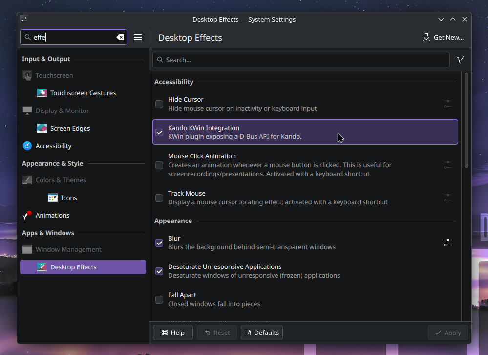

<!--
SPDX-FileCopyrightText: Simon Schneegans <code@simonschneegans.de>
SPDX-License-Identifier: CC-BY-4.0
-->

# KWin Integration for Kando

This KWin plugin is required for 🌸 [Kando](https://github.com/kando-menu/kando) 3.0.0 and beyond on KDE Plasma under Wayland.
Via a D-Bus interface, it provides the name of the currently focused window, the current mouse pointer position, and a few more pieces of information required by Kando.

## ⬇️ Installation

You can either build the plugin manually or use the pre-built release assets.

### 📦 Installing a Pre-Built Release

We provide some pre-built **binaries for popular distributions in the [releases section](https://github.com/kando-menu/kwin-integration/releases)**.
However, if your KWin version does not exactly match the one of the release assets, this will not work, and you will have to build the plugin manually.
You can check your KWin version with the following command:

```bash
kwin_wayland --version
```

Choose a download for this KWin version that most closely matches your distribution (e.g. choose `ubuntu-*` for a debian-based distribution, and `fedora-*` for Fedora or similar distributions).
Also make sure to choose the correct architecture (`-x64` for AMD64/Intel64, and `-arm64` for ARM64).
If you do not know your architecture, you can check it with the following command:

```bash
uname -m # prints x86_64 for AMD64/Intel64, and aarch64 for ARM64
```

Once downloaded, unzip the plugin and install it with the following command:

```bash
sudo cp kandointegration.so /usr/lib/qt6/plugins/kwin/effects/plugins
```

Have a look at the 🚀 **Usage** section below on how to check whether this worked.

### 🛠️ Building from Source

To build the plugin manually, you have to install the required development packages first, then clone the repository and build it with CMake.

#### Installing Dependencies

Required development packages include Qt6, ECM, and KWin development files.
For debian-based distributions, you can install these with:

```bash
sudo apt install build-essential cmake ninja-build pkg-config git extra-cmake-modules kwin-dev \
                 libdrm-dev libwayland-dev libxkbcommon-dev libxcb1-dev libxcb-util-dev \
                 libgl1-mesa-dev libinput-dev qt6-base-dev
```

For Fedora and similar distributions, use:

```bash
sudo dnf install gcc gcc-c++ make cmake ninja-build pkgconf-pkg-config git extra-cmake-modules \
                 kwin-devel libdrm-devel libepoxy-devel wayland-devel libxkbcommon-devel \
                 libxcb-devel xcb-util-devel mesa-libGL-devel libinput-devel qt6-qtbase-devel
```

If you are using Arch or a derivative, you can install the required packages with this, btw:

```bash
sudo pacman -S --needed base-devel cmake ninja pkgconf git extra-cmake-modules kwin libdrm \
                 wayland libxkbcommon libxcb xcb-util mesa libinput qt6-base vulkan-headers
```

#### Building and Installing

Then you can proceed to clone the repository, build the plugin, and install it.

```bash
git clone https://github.com/kando-menu/kwin-integration.git
cd kwin-integration
cmake -S . -B build
cmake --build build --config Release
sudo cmake --install build --config Release
```

## 🚀 Usage

After installation, you need to restart your session for the plugin to be loaded by KWin.
If everything is set up correctly, you will find a new entry called "Kando KWin Integration" in the list of KWin effects in the System Settings under "Apps & windows" → "Window Management" → "Desktop Effects".
Just make sure that this effect is enabled.



## 🗒️ Changelog

See [changelog.md](./changelog.md) for a detailed list of changes.
